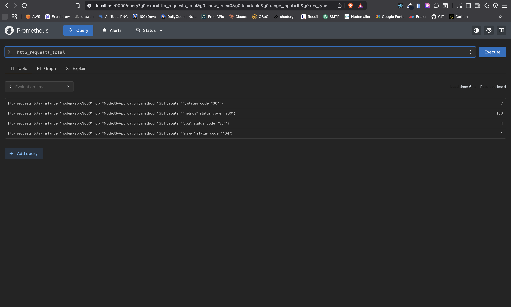
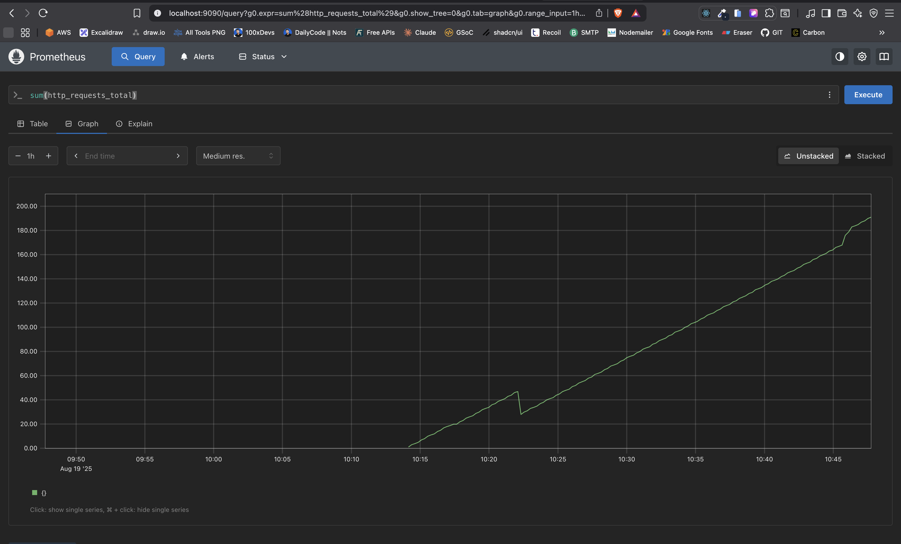
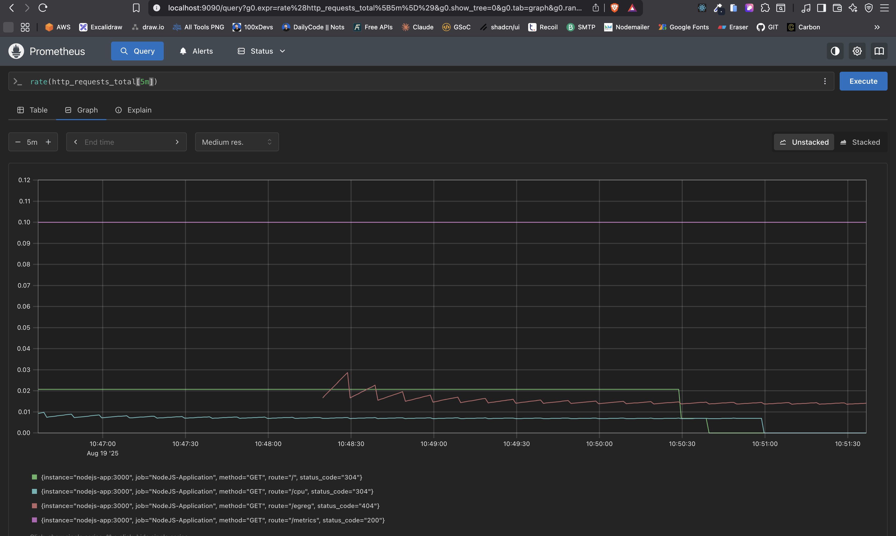
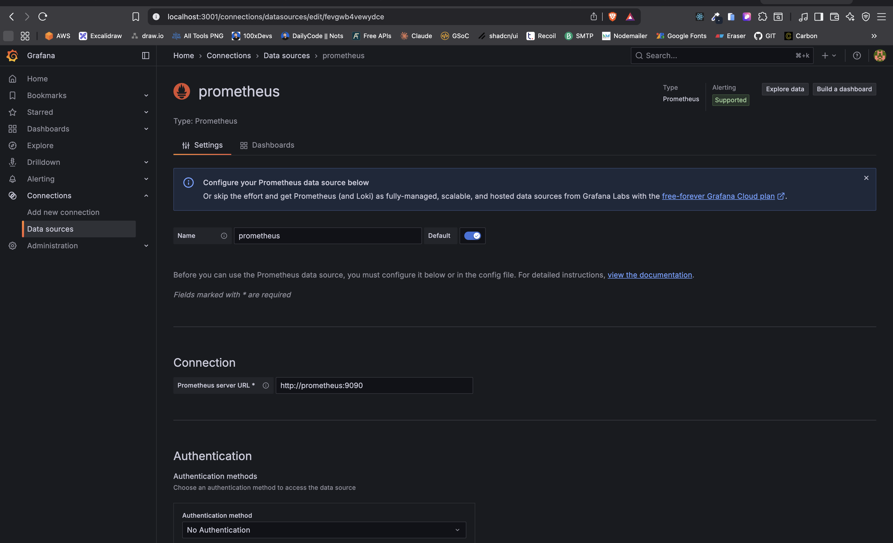
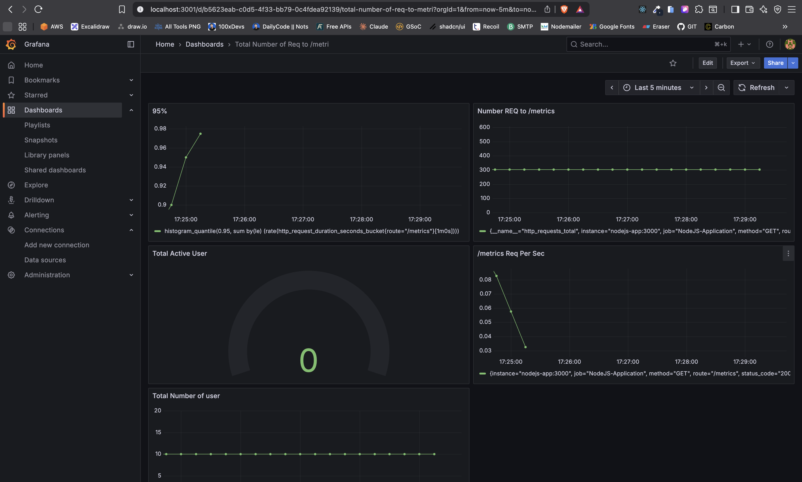
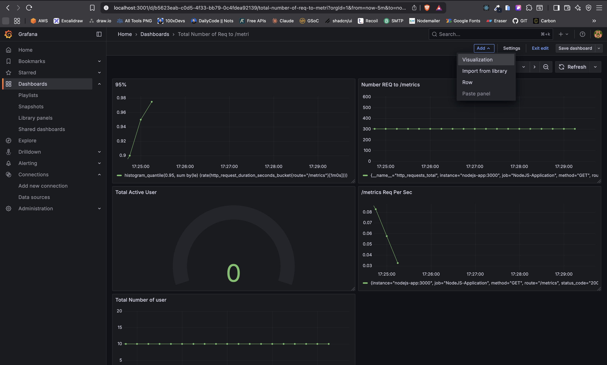
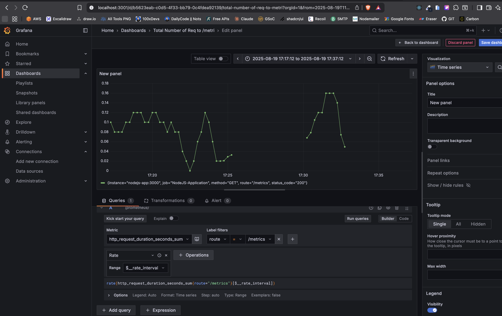

# Monitoring with Prometheus


### Create the Docker Network
```sh
docker network create monitoring
```

### Run the NodeJS Application
```sh
docker build -t nodejs-app .
docker run -p 3000:3000 --name nodejs-app --network monitoring nodejs-app
```

### Run Prometheus
```sh
docker run -p 9090:9090 --network monitoring -v ./prometheus.yml:/etc/prometheus/prometheus.yml prom/prometheus
```

### Run Grafana
```sh
docker run -p 3001:3000 --network monitoring -e GF_SECURITY_ADMIN_PASSWORD=admin grafana/grafana
```


### From Docker Compose
```sh
docker-compose up --build
```









